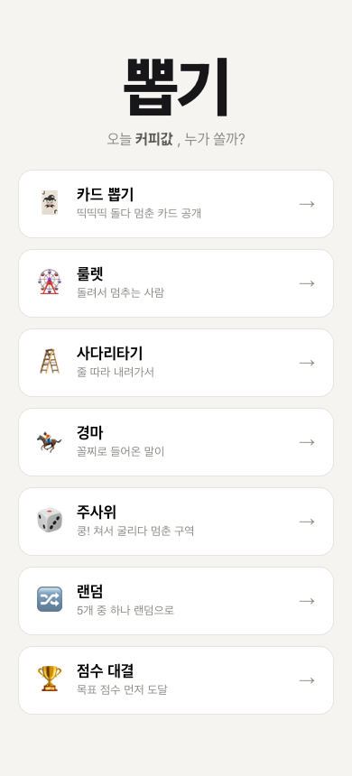
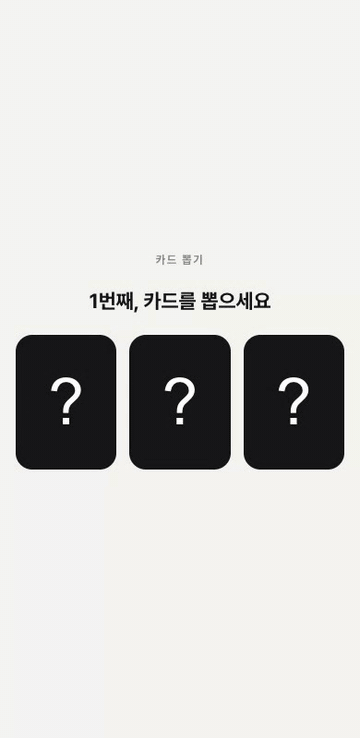
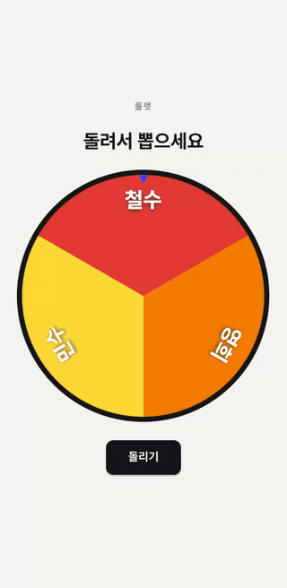
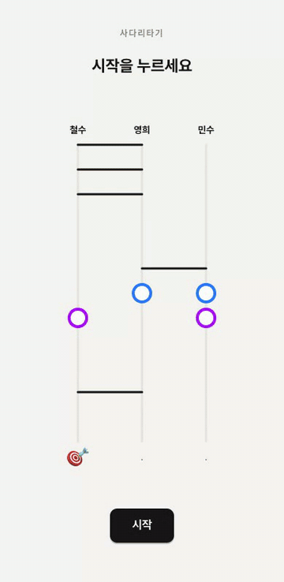
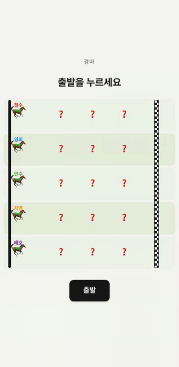
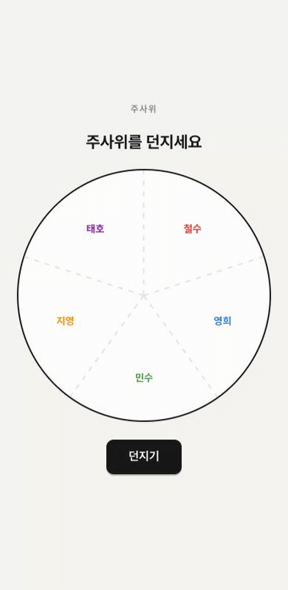

<h1 align="center">🎯 뽑기</h1>

<p align="center">
  <b>오늘 커피값, 누가 쏠까?</b><br/>
  한 화면에 모여서 하는 캐주얼 랜덤 추첨 게임
</p>

<p align="center">
  <a href="https://happy-wook-kim.github.io/bbobgi/"><b>▶️ 지금 바로 하기</b></a>
</p>

<p align="center">
  
</p>

## 🎮 게임

| 🃏 카드 뽑기 | 🎡 룰렛 |
| :---: | :---: |
|  |  |
| 참가자 순서대로 보라색 포커스가 띡띡띡<br/>돌다 멈춘 카드가 바로 뒤집혀요.<br/>🎯을 뽑은 분이 쏩니다 | 돌려서 포인터에 멈춘 분이 쏩니다.<br/>보너스 스핀으로 마지막까지 두근두근 |

| 🪜 사다리타기 | 🏇 경마 |
| :---: | :---: |
|  |  |
| 줄 따라 내려가다 포탈로 순간이동!<br/>🎯 출구에 도착한 분이 쏩니다 | ❓ 아이템(🪨 돌 · ⚡ 부스터)을 밟으며<br/>달려요. 마지막 세 마리의 접전은<br/>클로즈업으로! <b>꼴찌</b> 말의 주인이 쏩니다 |

| 🎲 주사위 | |
| :---: | :---: |
|  | 원형 아레나 위에서 ✋ 손바닥이 알아서<br/>10~20번 쿵쿵! 마지막 5번은 점점 세게<br/>강타하는 카운트다운 — 멈춘 부채꼴의<br/>주인이 쏩니다 (전원 같은 크기·모양 구역) |

### 🔀 랜덤 · 🏆 점수 대결

- **랜덤** — 다섯 중 어떤 게임이 나올지 시작 전까지 모릅니다.
- **점수 대결** — 판마다 걸린 사람이 +1점, 목표 점수를 먼저 채운 사람이 쏩니다.
  다섯 게임을 셔플한 "가방"에서 하나씩 꺼내므로 **한 바퀴를 다 돌기 전엔 같은 게임이 반복되지 않아요** (바퀴마다 순서도 새로 섞임).

## 🏇 경마 디테일

- 모든 레인의 1/4 · 2/4 · 3/4 지점에 정체 모를 ❓ 아이템 — 밟는 순간 🪨(정지) 또는 ⚡(1초 이상 질주)로 공개
- 말마다 💨 스퍼트 / 💦 지침 컨디션이 실시간으로 바뀌고, 레인 아래 속도계(km/h)로 표시
- 선두 그룹이 먼저 골인하면 **마지막 세 마리(꼴찌와 위아래 레인)가 끝까지 접전** — 트랙이 자동으로 줌인되어 클로즈업, 결판나면 줌아웃 (접전 밀착도·순위 스왑 테스트 보장)

## ⚖️ 공정성

- 카드·사다리·경마는 걸릴 사람이 게임 시작 전에 **균등 확률로 확정**되고(`pickWinner`), 애니메이션은 그 결과를 보여주는 연출일 뿐 결과를 바꾸지 못합니다.
- 룰렛은 물리 회전 자체가 균등 분포입니다 (200만 회 시뮬레이션 검증).
- 주사위는 순수 물리(충격·마찰·원형 벽 반사)가 결과를 정하며, 600판 시뮬레이션으로 구역 확률 균등성을 검증합니다.
- 경마의 돌·부스터·스퍼트도 도착 순서에 영향이 없습니다 — 전부 Vitest 테스트로 보장.

## 🛠 개발

Vite + React 19 + TypeScript, 테스트는 Vitest.

```bash
pnpm install
pnpm dev     # 개발 서버
pnpm test    # 엔진 단위 테스트
pnpm build   # 타입 검사 + 번들
```

`main`에 푸시하면 GitHub Actions가 GitHub Pages로 자동 배포합니다.
